# Figures

## Part I: Reward Basics

### Total Reward Daily
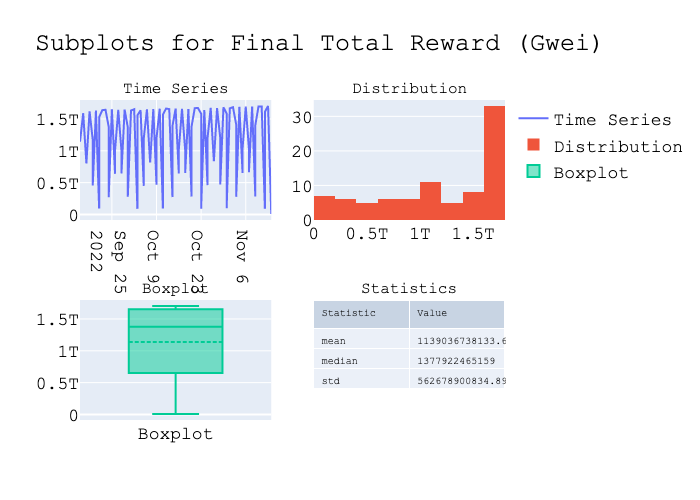

### Total Reward Epoch
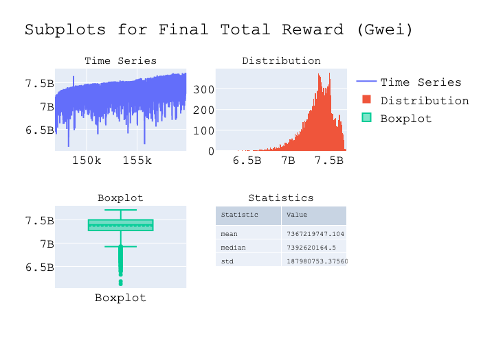

### Validator Count
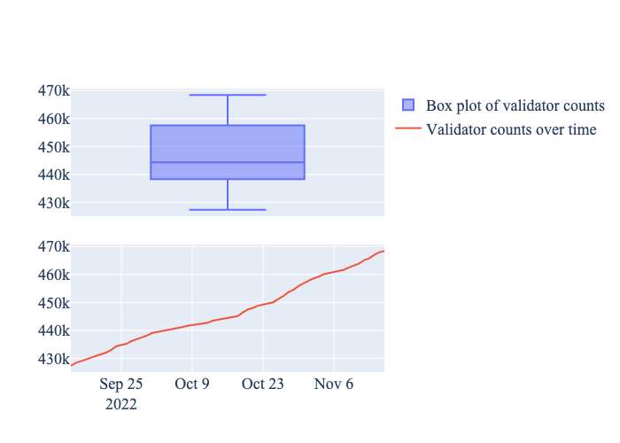

### Validator Reward Mean
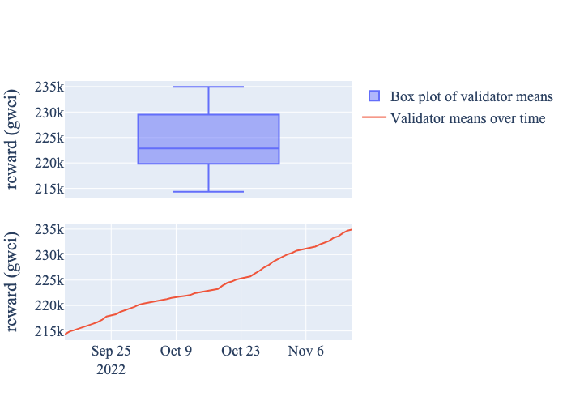

## Part II: Reward Taxonomy

### Reward4 Histogram Daily
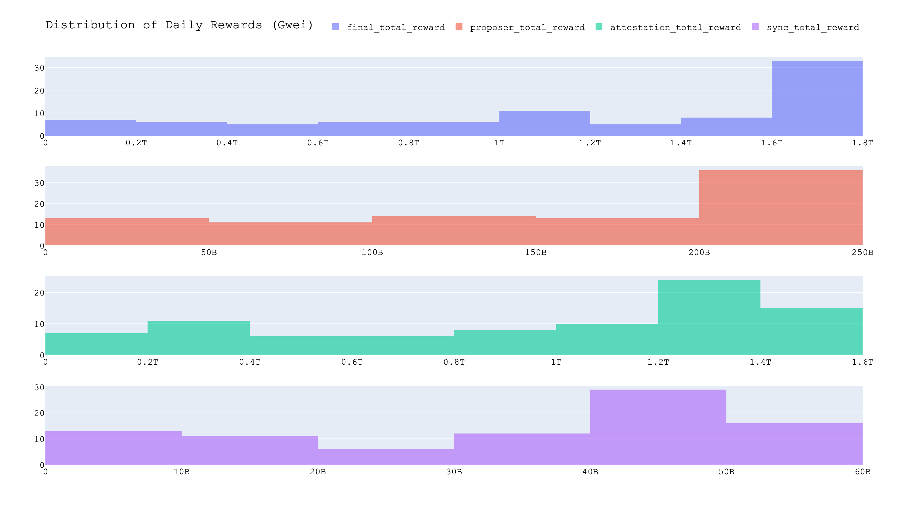

### Reward4 Histogram Epoch
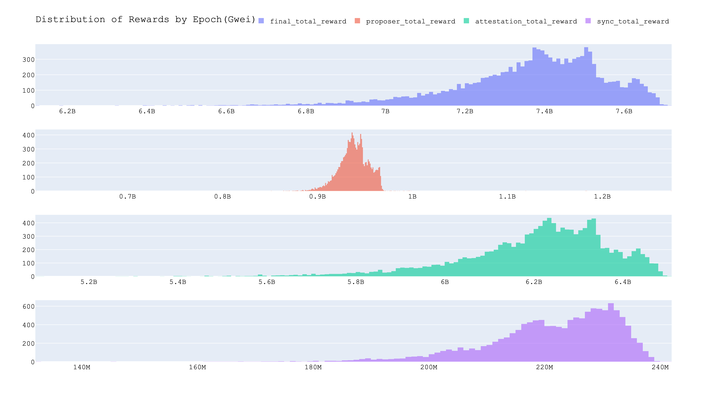

### Reward3 Timeseries Percentage Daily
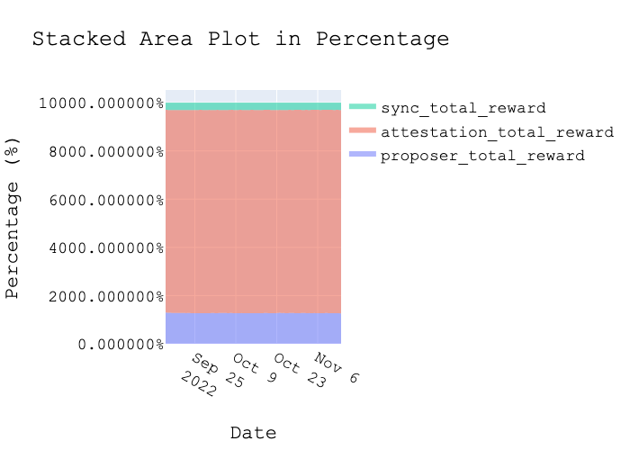

### Reward3 Timeseries Percentage Epoch
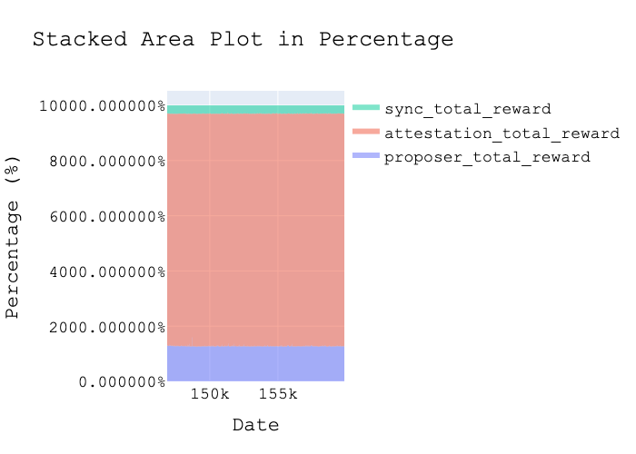

### Reward3 Timeseries Daily
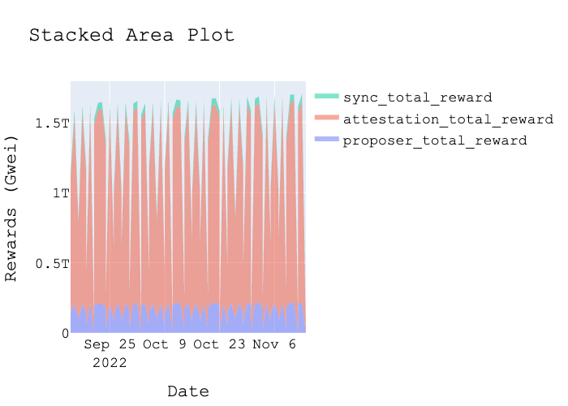

### Reward3 Timeseries Epoch
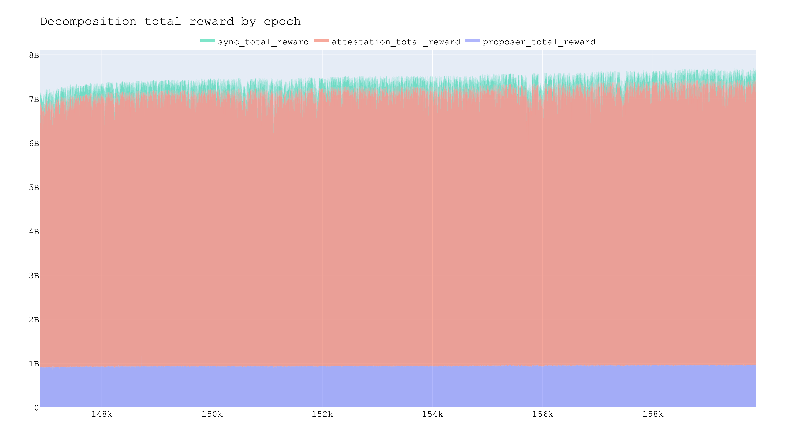

### Reward4 Correlation Daily
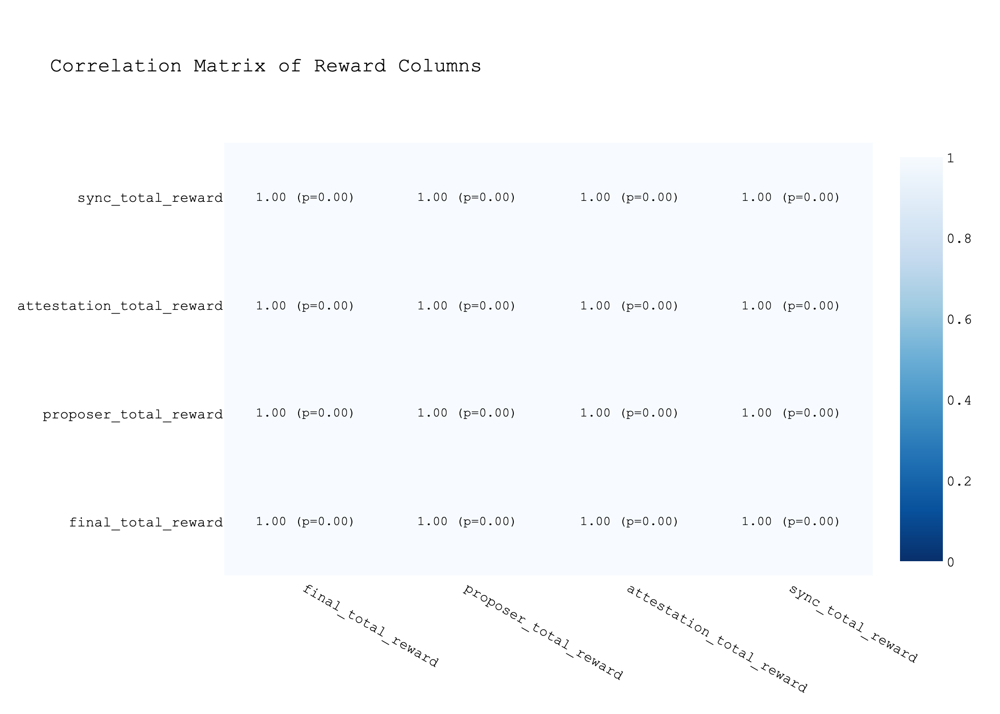

### Reward4 Correlation Epoch
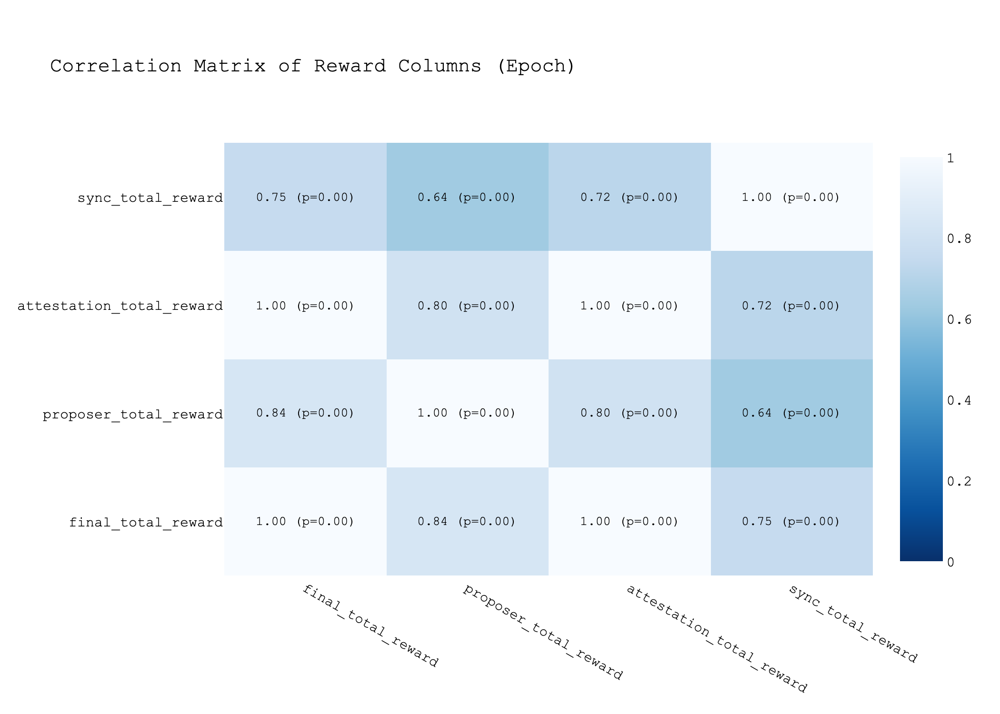

## Part III Decentralization Index

### Index Boxplots
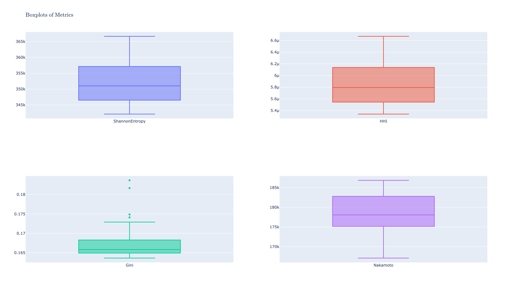

### Index Timeseries
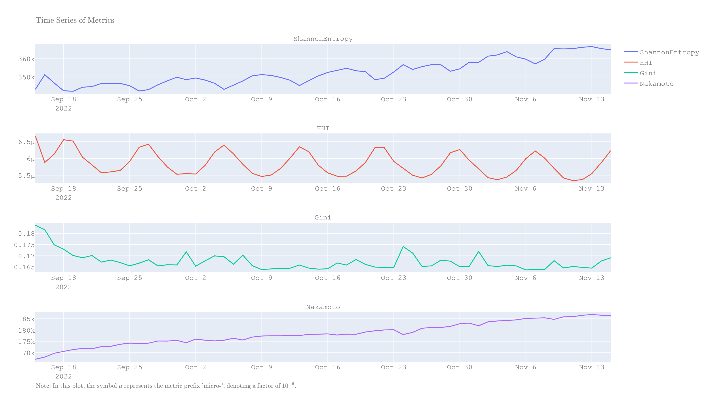

### Index Violin
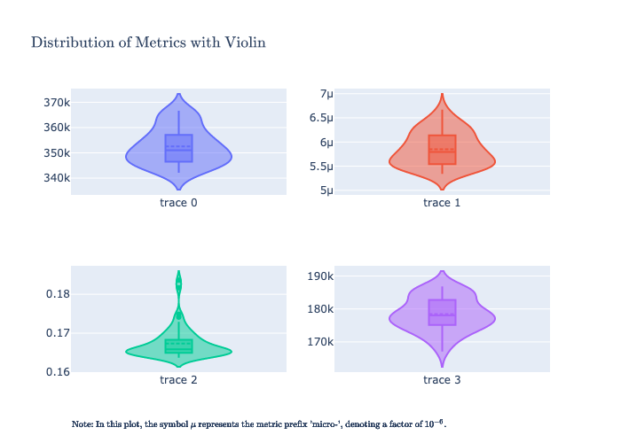

## Autocorrelation and Decomposition
### Gini Autocorrelation
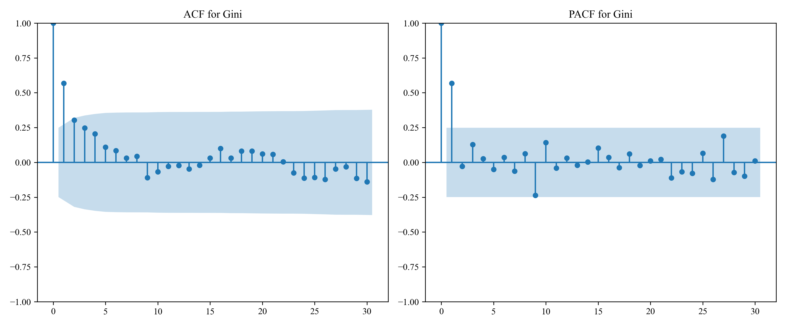

### Gini Decomposition

### HHI Autocorrelation
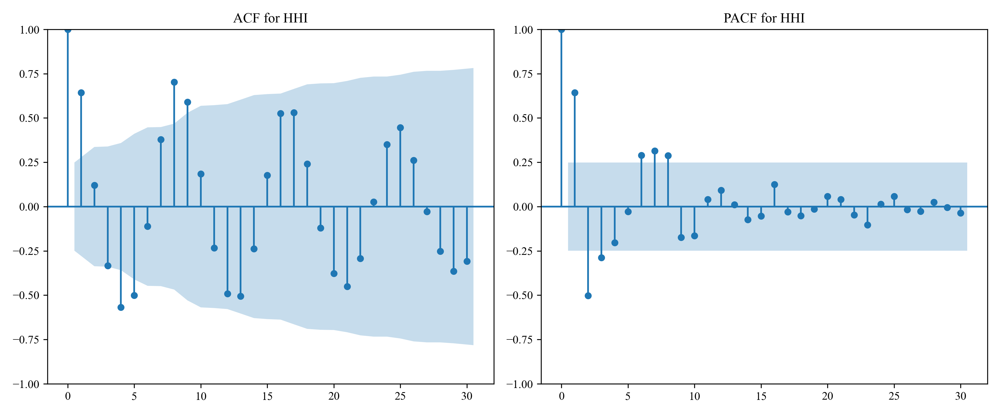

### HHI Decomposition
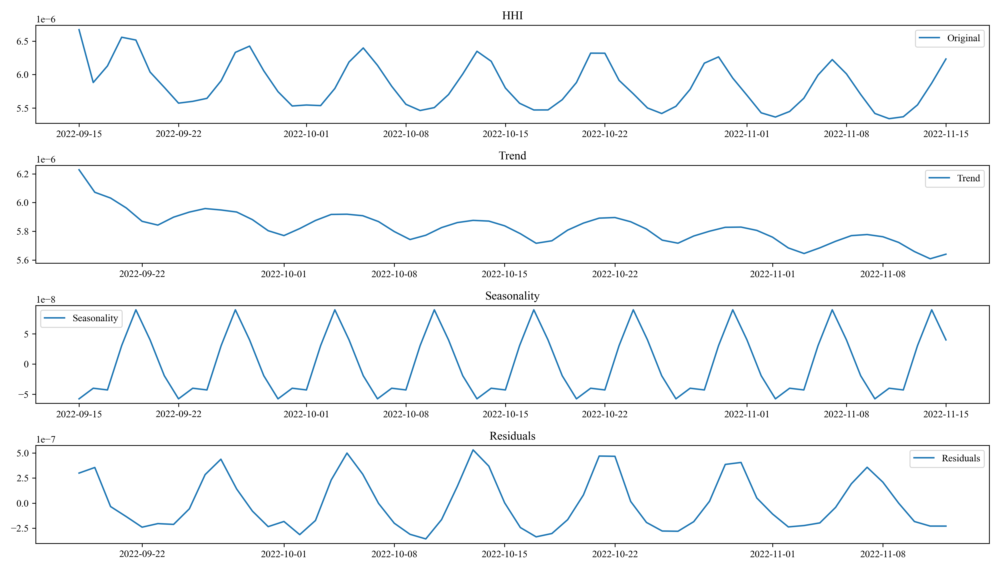

### Nakamoto Autocorrelation
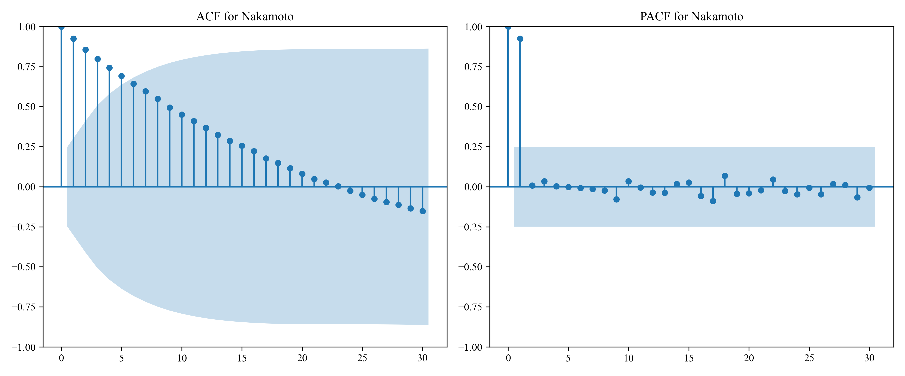

### Nakamoto Decomposition
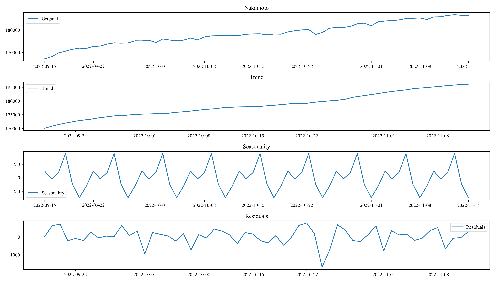

### ShannonEntropy Autocorrelation

### ShannonEntropy Decomposition
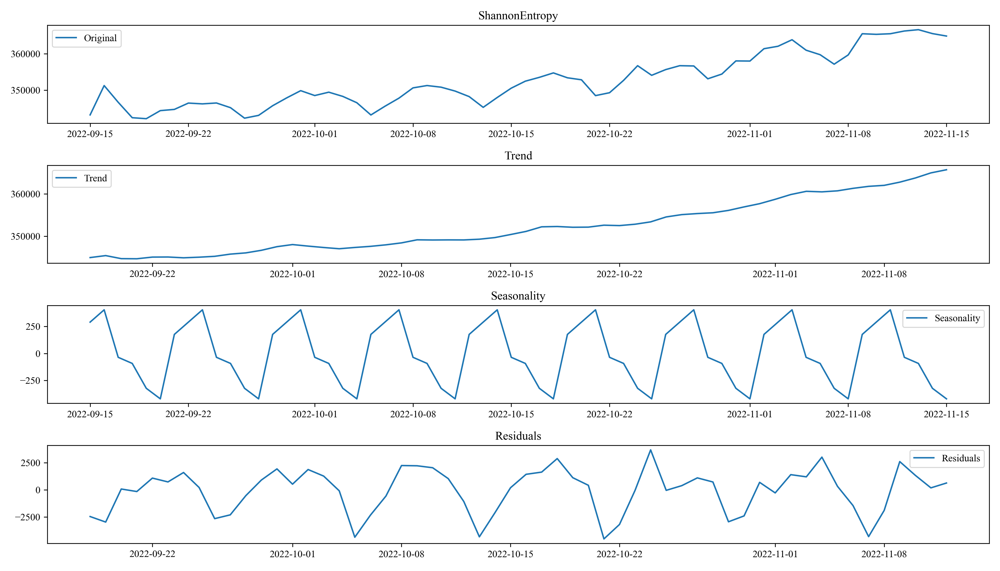